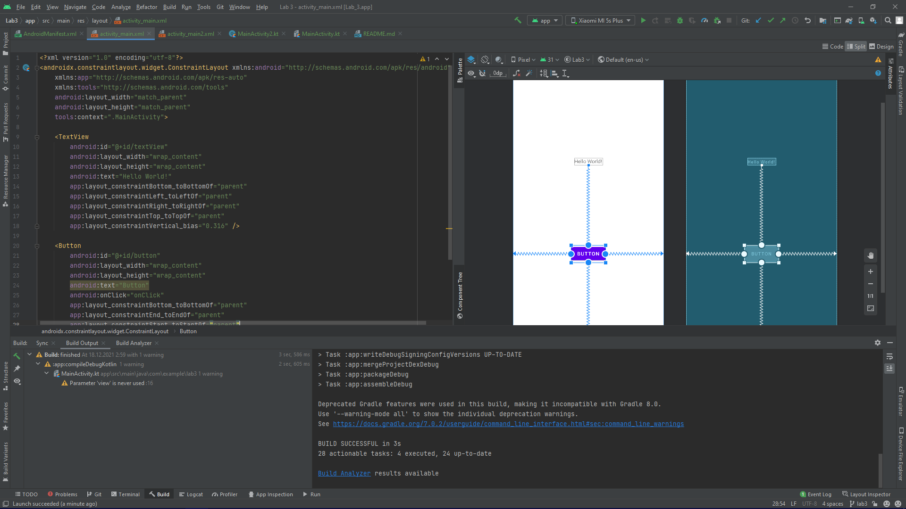
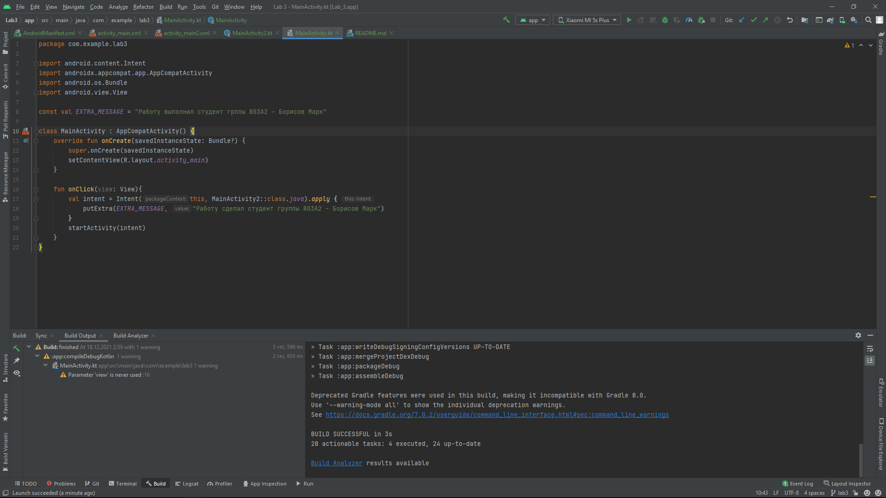
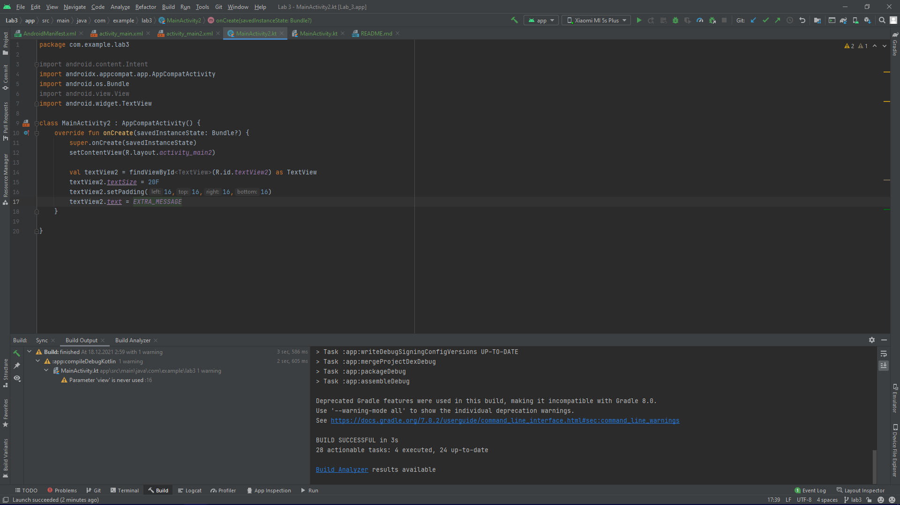
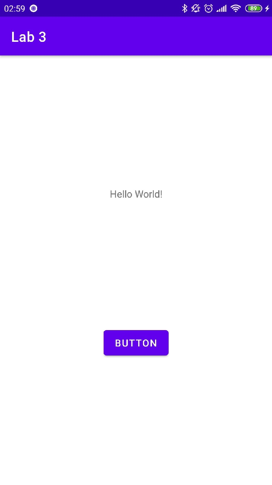

# Mobile-application-development
Разработка мобильных приложений, лабораторные работы от ***Борисова Марка студента группы 803а2***

---
### Лабораторная работа №2 ветка - Lab 2
---
> Цель данной работы - разработать мобильное приложение с использованием нескольких компонентов;
### Шаг 1 
``Добавим button``
>>
### Шаг 2
``Обработаем событие нажатия и передадим текст``
>
### Шаг 4
``Выведем текст``
>
### Шаг 3
``Скриншоты приложения``  
>
>

