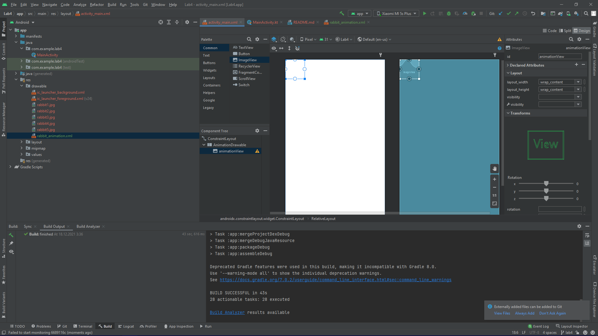
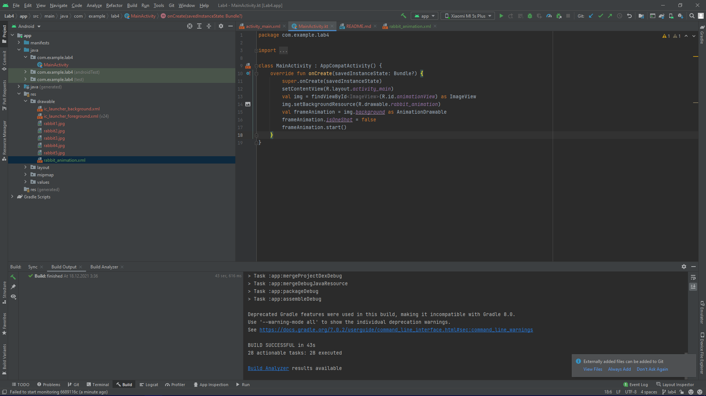
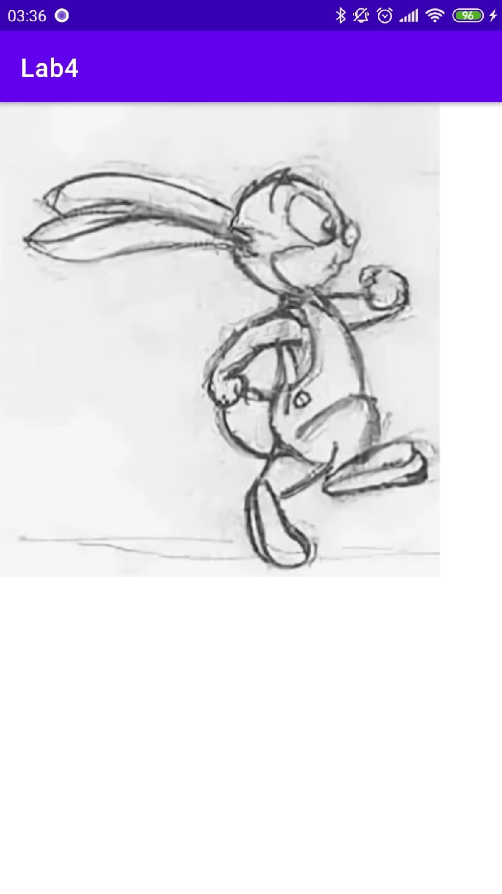

# Mobile-application-development
Разработка мобильных приложений, лабораторные работы от ***Борисова Марка студента группы 803а2***

---
### Лабораторная работа №4 ветка - Lab 4
---
> Цель данной работы - pазработать дизайн приложения с выводом анимации.
### Шаг 1 
``Поместим компоненты RelativeLayout и ImageView и установим разметки:``
>>
### Шаг 2
``Добавить запуск анимации:``
>
### Шаг 3
``Скриншоты приложения``
>

