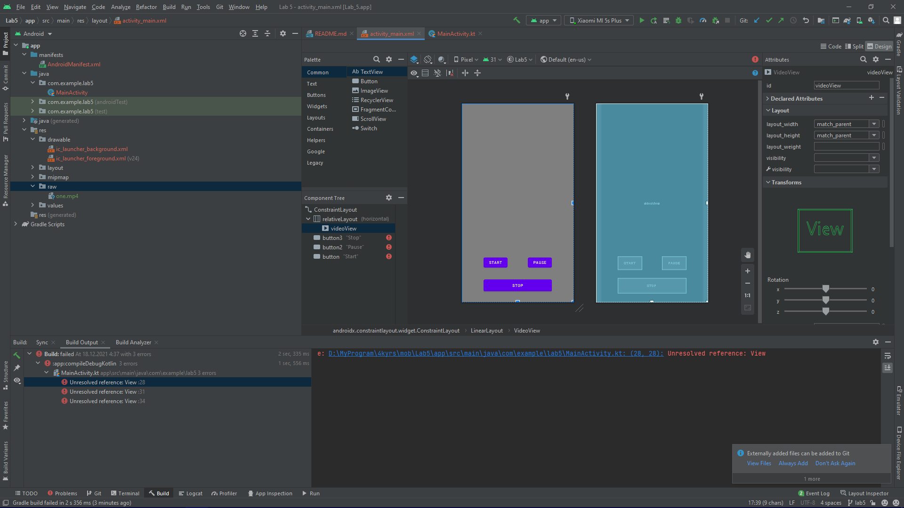
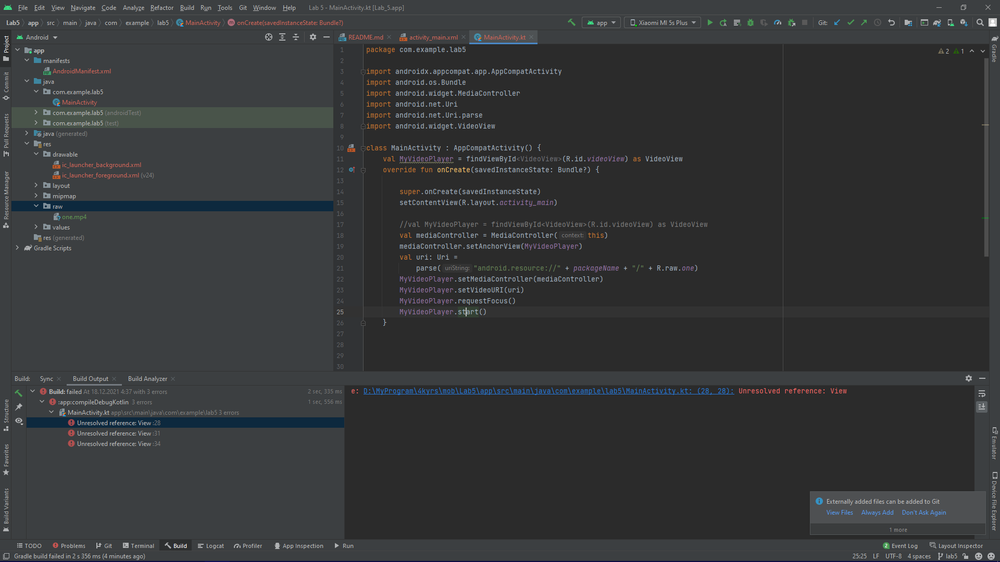
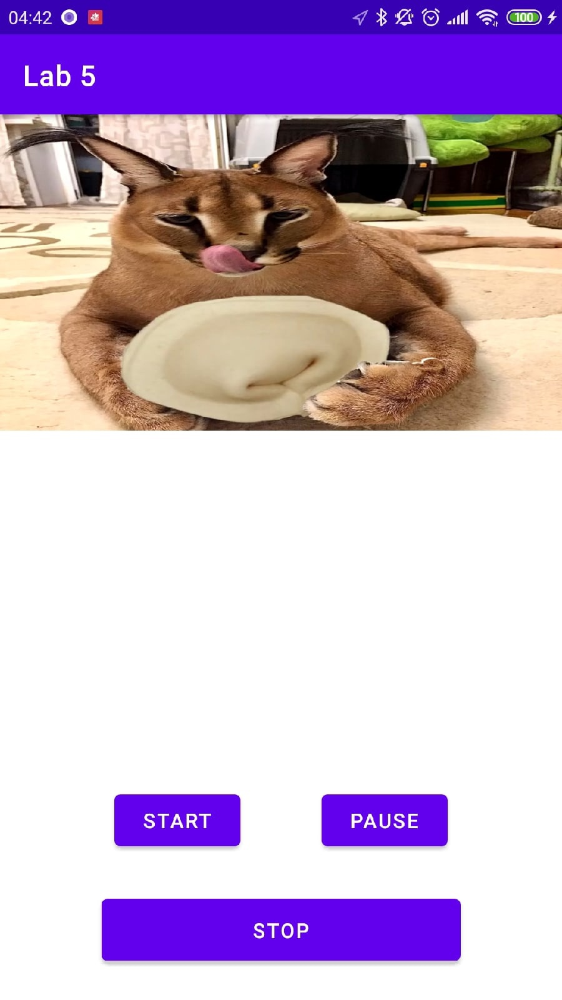

# Mobile-application-development
Разработка мобильных приложений, лабораторные работы от ***Борисова Марка студента группы 803а2***

---
### Лабораторная работа №5 ветка - Lab 5
---
> Цель данной работы - pазработать свой видео или аудио проигрыватель.
### Шаг 1 
``Поместим компоненты RelativeLayout и VideoView и установим разметки:``
>>
### Шаг 2
``Запуск видео``
>
### Шаг 3
``Скриншоты приложения``
>

