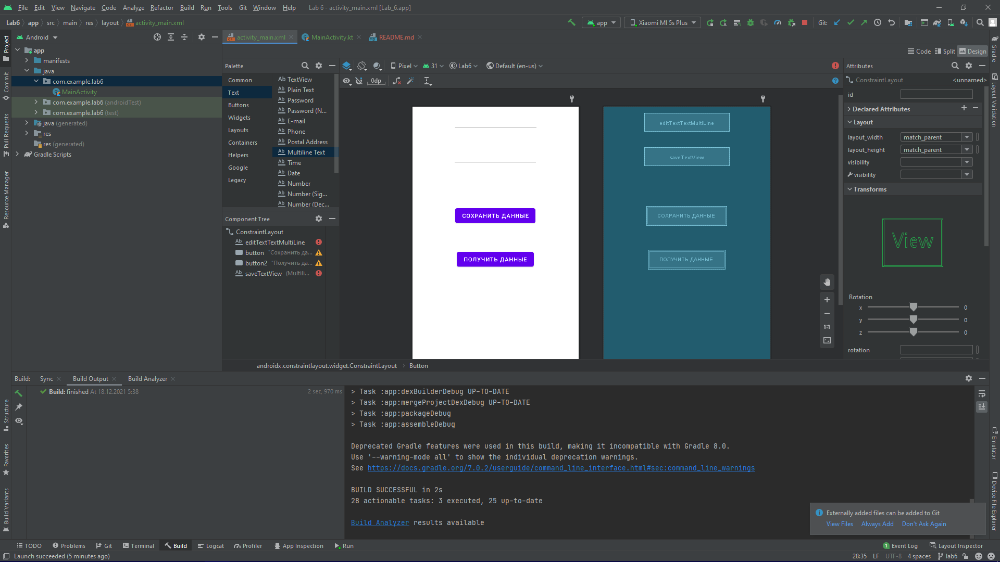
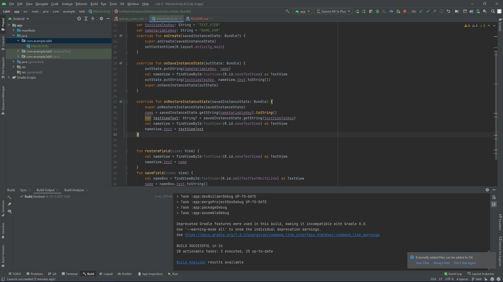
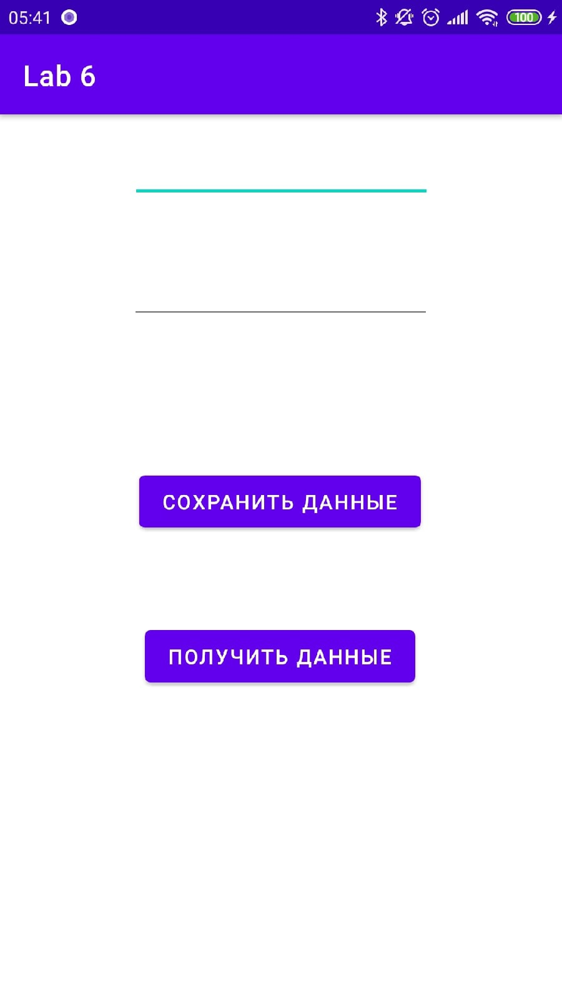
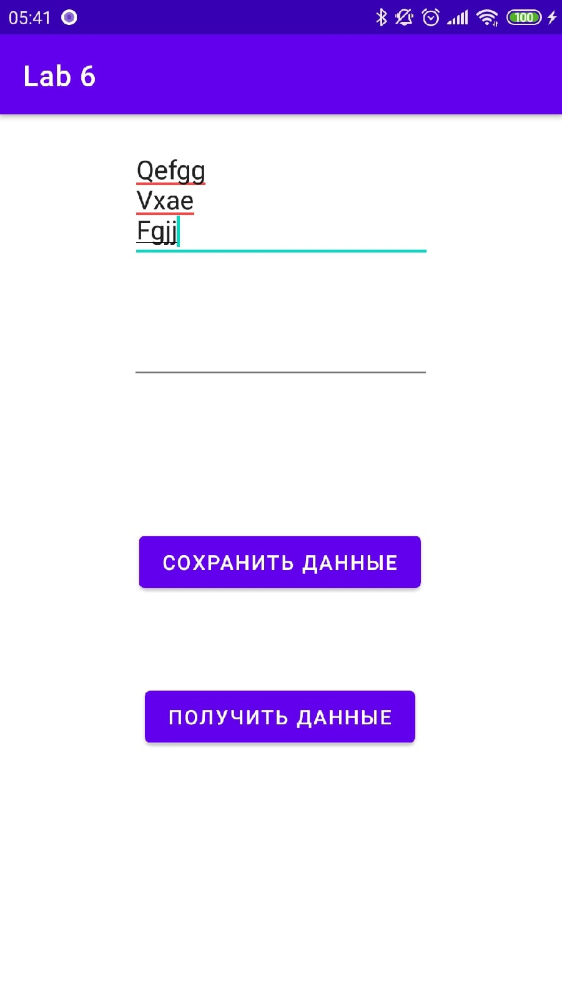
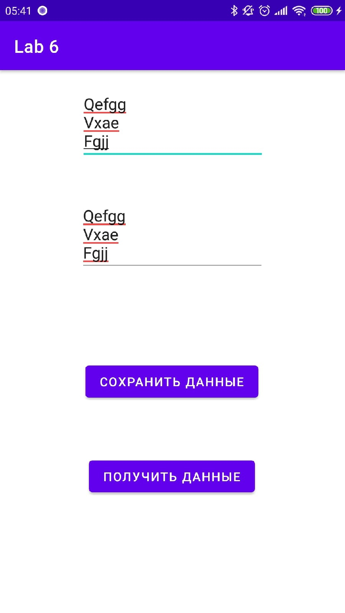

# Mobile-application-development
Разработка мобильных приложений, лабораторные работы от ***Борисова Марка студента группы 803а2***

---
### Лабораторная работа №6 ветка - Lab 6
---
> Цель данной работы - научиться сохранять данные при изменении ориентации смартфона.
### Шаг 1 
``Добавим поля и кнопки``
>>
### Шаг 2
``обработаем``
>
### Шаг 3
``Скриншоты приложения``
>
>
>

