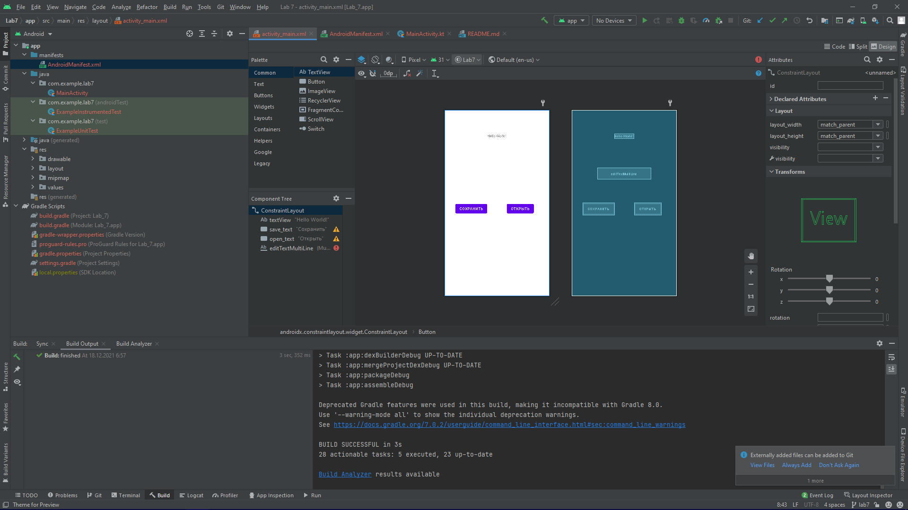
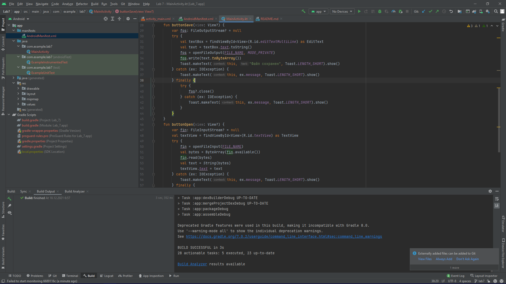
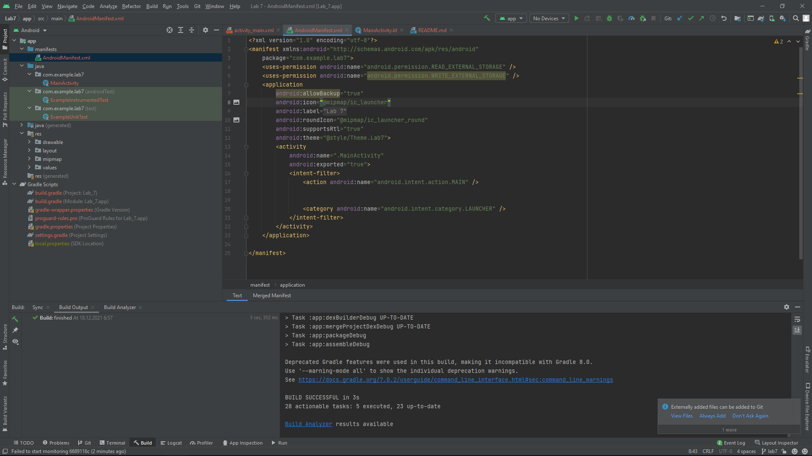
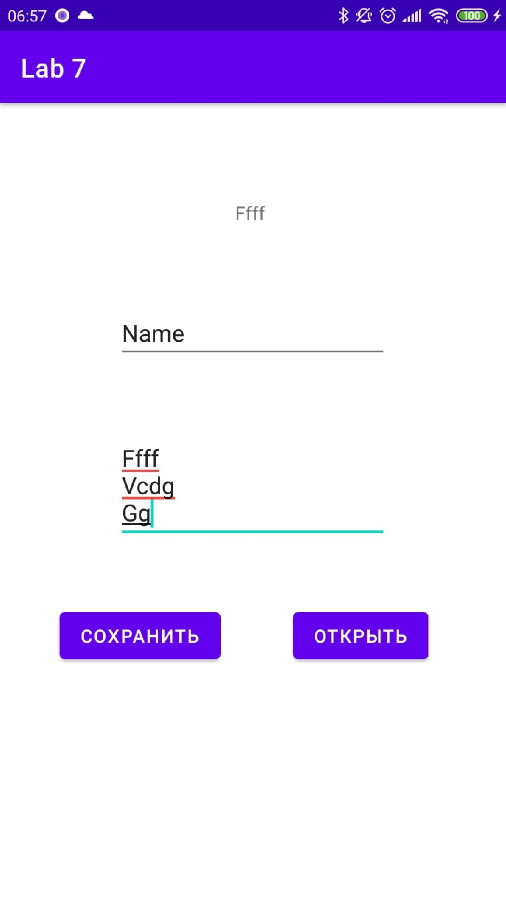
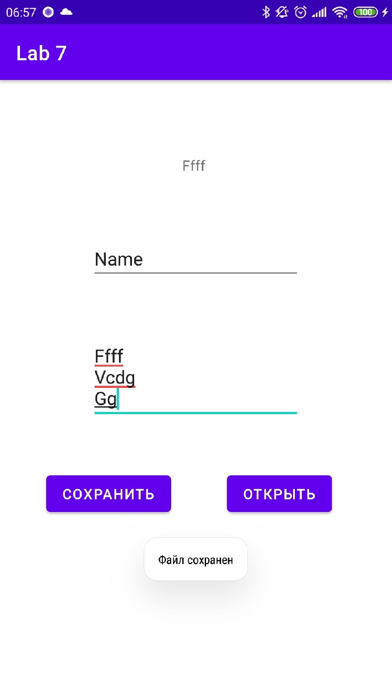
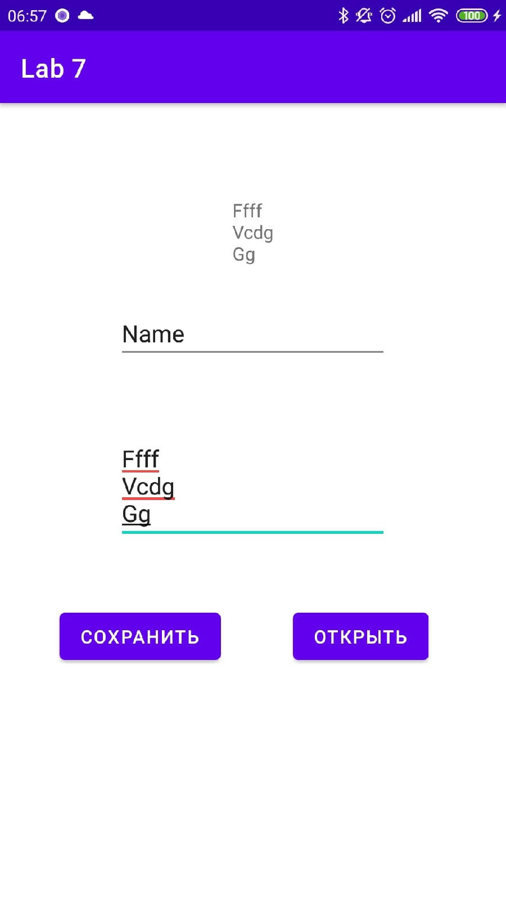

# Mobile-application-development
Разработка мобильных приложений, лабораторные работы от ***Борисова Марка студента группы 803а2***

---
### Лабораторная работа №7 ветка - Lab 7
---
> Цель данной работы - Научиться сохранять данные в текстовый файл и считывать из него.
### Шаг 1 
``Добавим поля и кнопки``
>>
### Шаг 2
``обработаем``
>
### Шаг 3
``Скриншоты приложения``
### Шаг 4
``Пропишем разрешения``
>
### Шаг 5
``Скриншоты ``
>
>
>